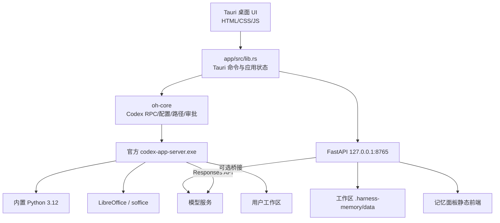
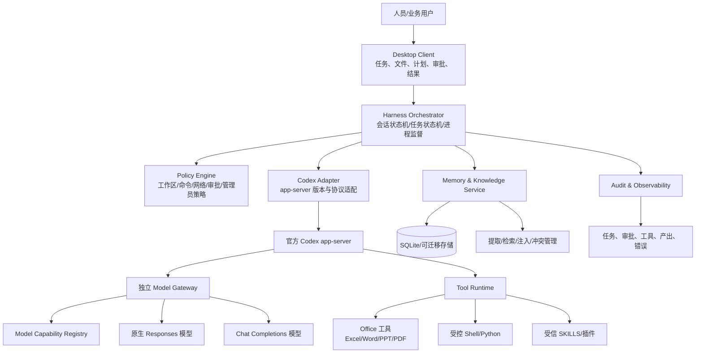

# ds_codexharness 项目细致评估与后续开发建议

> 评估对象：`YuanKai-Livevin/ds_codexharness`  
> 评估基线：`main` 分支，审查时 HEAD 为 `83d2d1a665d04bd4a4ab6ddbb05425dd2ad2697c`  
> 评估日期：2026-08-27  
> 评估方式：源码静态审查、依赖关系与数据流分析；未在目标 Windows 内网环境中运行预编译分卷安装包，也未反编译发布 EXE。

---

## 1. 执行摘要

`ds_codexharness` 当前已经形成一条正确且有价值的技术主线：

- 复用 OpenAI 官方开源 Codex 的 `app-server`、Windows sandbox 和 command runner，而不是自行重写 Agent Loop；
- 使用 Tauri + Rust 构建 Windows 桌面产品层；
- 使用 Python 运行时承担 Excel、Word、PPT、PDF、图片等办公自动化能力；
- 支持 DeepSeek 或其他 OpenAI 兼容模型；
- 为只支持 `/chat/completions` 的内网模型网关提供 Responses API 兼容桥；
- 引入工作区、审批、会话、SKILLS 和阶段交接机制。

从产品方向看，它适合发展为：

> **一个面向非程序员和业务人员、以“受控执行”为核心的人机协同 Harness 工具。用户负责目标、判断和审批，Harness 负责理解任务、组织步骤、调用工具、生成或修改文件，并留下可审查、可回滚的执行记录。**

当前项目不应被视为“已经完成的企业级办公 Agent”，而应被视为一个功能覆盖较广、但核心链路仍需加固的 v0.3 原型。主要问题不在于技术方向错误，而在于几项关键能力尚未闭环：

1. Responses → Chat 协议桥与官方 Codex 的真实工具结构不完全匹配，可能导致桥接模式下工具调用失效；
2. 本地模型网关、记忆服务和静态面板被耦合在同一 FastAPI 进程，且固定端口、无运行时鉴权，安全边界不足；
3. 记忆压缩存在明确的候选集错误，可能把本不应压缩的记忆一起替换；
4. 自定义模型供应商配置、免密钥连接测试、权限切换和最近工作区保存存在确定性缺陷；
5. 进程状态、构建可复现性、依赖锁定、测试体系和供应链治理尚不足以支撑长期多人协作和企业部署；
6. 当前“记忆面板”本质上是手工记忆块与阶段交接工具，还不是会自动提取、检索和注入的 Agent 长期记忆。

因此推荐路线不是重写 Harness，也不是立即 fork Codex 内核，而是：

> **继续将官方 Codex app-server 作为可替换的执行核心，在外围建立稳定的产品控制层：独立模型网关、能力注册、策略引擎、工具运行时、记忆服务、审计与更新体系。**

---

## 2. 最终目标的重新定义

用户给出的最终目标是：

> 使用一个 Harness 工具辅助人员提效。

这个目标方向正确，但范围过宽。为了避免项目继续以“功能堆叠”方式扩张，建议把目标拆成四层。

### 2.1 用户价值层

Harness 应帮助人员完成以下类型的工作：

- 理解和整理复杂任务；
- 批量读取、转换、统计和修改办公文件；
- 根据模板生成文档、表格、报告、PPT；
- 对工作结果进行检查、比较和修复；
- 将重复流程沉淀为可复用技能；
- 在长任务或跨阶段任务中保留必要上下文；
- 在不牺牲安全和可审查性的情况下减少人工操作步骤。

### 2.2 产品边界层

Harness 不应成为一个“聊天框里什么都能做”的黑箱。它应明确坚持：

1. **用户拥有目标和最终决策权。**
2. **模型负责建议和规划，确定性工具负责执行。**
3. **高风险动作必须经过硬审批，而不是只依赖提示词。**
4. **输出物优先于聊天文本。**最终价值是文件、报告、数据、变更和审计记录。
5. **所有操作必须有范围、来源、结果和可回滚策略。**
6. **模型可替换。**产品价值不能绑定某一个 DeepSeek 或 OpenAI 模型。

### 2.3 技术目标层

一个成熟的人员提效 Harness 至少需要五个核心能力：

- **理解与规划**：把自然语言目标转成可执行步骤；
- **受控执行**：在明确权限和工作区内调用工具；
- **结果验证**：验证文件是否生成、数据是否正确、格式是否满足要求；
- **人机审批**：在关键节点展示计划、差异、风险和最终结果；
- **复用与积累**：把稳定流程沉淀为技能、模板、知识和阶段交接。

### 2.4 成功标准层

项目不应只统计“是否能聊天”或“是否能生成文件”，而应至少衡量：

- 任务成功率；
- 用户接受产出物的比例；
- 需要人工返工的比例；
- 未授权访问次数必须为 0；
- 高风险动作审批覆盖率；
- 失败后可恢复率；
- 单个成功任务的人机交互步骤数；
- 相比纯人工流程节省的操作时间；
- 模型调用成本和成功任务成本；
- 技能复用率。

---

## 3. 当前项目定位

当前项目可以概括为：

```text
官方 Codex app-server
        +
自研 Windows Tauri 桌面客户端
        +
DeepSeek / 内网模型接入
        +
Responses ↔ Chat 协议桥
        +
Python 办公运行时
        +
工作区、审批、会话和 SKILLS
        +
旁路记忆与阶段交接面板
```

它不是：

- 自行实现的 Codex Harness；
- 本地模型推理服务器；
- 完整的企业知识库；
- 已经成熟的通用办公平台；
- 官方 Codex App 的完整复刻。

这种定位本身合理。它充分利用了 Codex 已经完成的 Agent Loop、工具调用、Shell、文件修改、会话和沙箱能力，将开发精力集中在 Windows 产品化和内网适配上。

---

## 4. 当前设计评价

## 4.1 设计上的优点

### 4.1.1 没有重复实现 Agent Loop

项目直接下载并运行官方 Codex `rust-v0.149.0` 的：

- `codex.exe`；
- `codex-app-server.exe`；
- `codex-command-runner.exe`；
- `codex-windows-sandbox-setup.exe`。

这意味着项目可以继承官方 Codex 的会话、Turn、工具调用、命令执行、审批和沙箱能力，避免从零重写复杂且高风险的 Agent Runtime。

这条路线应继续保持。只有当官方 app-server 无法支持产品所需的关键行为，而且外围扩展确实无法解决时，才考虑 fork Codex。

### 4.1.2 Rust 与 Python 的职责选择基本正确

- Rust/Tauri 适合进程管理、系统权限、DPAPI、文件边界、桌面 UI 和事件转发；
- Python 适合办公文件处理、快速编写工具和协议转换；
- HTML/CSS/JS 适合快速构建轻量桌面界面。

问题不在于语言组合，而在于当前模块之间的边界还不够清晰。

### 4.1.3 工作区和审批概念符合最终目标

对非程序员开放可执行 Agent 时，必须有：

- 工作范围；
- 权限模式；
- 风险提示；
- 操作审批；
- 结果可见性。

项目已经具备这些概念，说明产品设计不是单纯把模型接到 Shell，而是考虑了人机协同和风险控制。

### 4.1.4 SKILLS 方向有长期价值

将稳定流程沉淀为 `SKILL.md`，可以逐步把一次性 Prompt 转换为组织可复用的工作方法。这比无限增加硬编码按钮更适合 Harness 产品。

但 SKILLS 未来必须按插件和可执行资产治理，而不是普通文件夹治理。

### 4.1.5 阶段总结比无限延长单个会话更现实

在长任务中强行保留全部历史会导致：

- 上下文变长；
- 模型注意力下降；
- 成本上升；
- 错误信息长期残留。

项目采用“阶段总结 → 新会话”的思路是合理的。问题是当前阶段总结和记忆系统还没有与真实任务状态形成自动闭环。

---

## 4.2 设计上的不足

### 4.2.1 产品目标与当前功能重心仍有偏差

项目界面和提示词强调“办公自动化”，但当前最成熟的能力仍是：

- Codex 会话；
- Shell 和文件修改；
- Python 脚本执行；
- 工作区文件浏览。

而业务人员真正关心的是：

- 我要处理哪些文件；
- Harness 准备怎么处理；
- 哪些内容会被改；
- 改完是否正确；
- 结果在哪里；
- 不满意能否撤销。

当前 UI 仍偏“Agent 调试台”，还不完全是“业务任务工作台”。后续应从聊天驱动逐步转向任务和产出物驱动。

### 4.2.2 关键控制与提示词控制混合

项目一方面有 Codex approval 和 Windows sandbox，另一方面又通过开发者提示词要求模型先输出计划和警告。

提示词适合改善行为，不适合作为安全边界。后续应明确：

- 文件范围、命令策略、网络权限、审批和回滚属于硬控制；
- 执行计划、解释方式、结果摘要属于软行为指导。

### 4.2.3 “记忆”概念不够准确

当前记忆面板更像：

- 用户手工维护的项目卡片；
- 记忆块压缩器；
- 阶段总结与 Handoff 工具。

它还不是会自动从对话和工具结果中提取事实、按任务相关性检索并注入上下文的长期记忆系统。

如果继续使用“自动记忆”作为产品宣传，会造成用户预期偏差。建议在真正完成自动提取与检索闭环前，将其描述为“阶段记录与交接面板”。

### 4.2.4 内网兼容被设计成单一开关，实际兼容性更复杂

模型服务能力不能只分为：

- 支持 Responses；
- 只支持 Chat Completions。

实际还应区分：

- 是否支持函数工具；
- 是否支持并行工具；
- 是否支持 reasoning；
- 是否支持 structured output；
- 是否支持图片；
- 是否返回 usage；
- 是否支持取消；
- 上下文窗口多大；
- tokenizer 是什么；
- 流式事件格式是否标准。

后续应建立“模型能力档案”，而不是依赖两个复选框。

---

## 5. 当前架构评价

## 5.1 当前架构



## 5.2 架构合理之处

- 官方 Codex app-server 作为执行核心，避免重复造轮子；
- Tauri 与 app-server 通过 stdio JSON-RPC 通信，边界清楚；
- 模型 API 和本地工具执行分离；
- Python 运行时随产品分发，减少终端用户环境配置；
- 工作区数据放在工作区内，便于项目级隔离；
- DPAPI 用于保存 API Key，适合 Windows 单用户场景。

## 5.3 架构问题

### 5.3.1 模型网关与记忆服务耦合

同一个 FastAPI 进程同时负责：

- `/responses` 模型协议代理；
- 记忆块 CRUD；
- 阶段总结；
- Handoff；
- 静态前端。

模型网关属于 Harness 的关键链路，记忆面板属于可选增强功能。二者不应共用生命周期、端口和错误处理。

### 5.3.2 应用状态由多份布尔值维护

CodexServer 内部有 `running`，Tauri AppState 还有 `engine_running`，前端又有 `state.running`。子进程异常退出时，这些状态可能不同步。

应由统一的 Process Supervisor 维护真实状态，前端只消费单一状态机。

### 5.3.3 核心文件过于集中

当前主要逻辑集中在：

- `app/src/lib.rs`；
- `oh-core/src/codex.rs`；
- `app/assets/app.js`。

多人协作时会导致：

- 修改冲突频繁；
- 测试难以隔离；
- 责任边界不清；
- 新成员难以快速理解；
- 一处状态修改影响多个功能。

### 5.3.4 缺少独立工具运行层

目前办公能力主要依赖模型自行生成 Python 脚本并运行。这种方式灵活，但：

- 行为不稳定；
- 同一任务每次实现不同；
- 难以统一验证；
- 难以审计；
- 容易重复生成临时脚本。

长期应建立受控的 Office Tool Runtime，把高频稳定操作做成确定性工具，模型负责选择和组合工具。

---

## 6. 功能评价

| 功能域 | 当前状态 | 评价 |
|---|---|---|
| Codex 会话 | 已实现基础新建、切换、读取、删除 | 基础可用，但恢复内容只渲染用户/助手文本，工具历史和执行状态未完整恢复 |
| Shell / 文件执行 | 依赖官方 Codex | 技术方向正确，是产品核心基础 |
| 审批 | 已支持命令和文件修改审批 | 需要补充批量审批、仅本次/本会话规则、审批审计 |
| Windows sandbox | 接入官方配置接口 | 应补充真实路径、junction、全权限模式和管理员策略验证 |
| 工作区 | 支持添加、切换、浏览、@引用 | 应加强最终路径验证、索引、搜索和大目录性能 |
| 模型接入 | 支持 DeepSeek、自定义 base URL、免密钥 | 自定义 provider 和免密钥部分存在缺陷，需要能力探测 |
| Responses 原生模式 | 依赖上游服务兼容性 | 推荐主路径，应提供协议自检 |
| Chat bridge 模式 | 已有手写转换 | 尚未证明与真实 Codex 工具协议完全兼容，是当前最大功能风险 |
| Python 办公环境 | 有构建脚本与常用库 | 依赖未完全锁定，FastAPI/uvicorn/tiktoken 未纳入同一构建闭环 |
| LibreOffice | Rust 后端有打开和转换函数 | 构建和主界面未形成完整闭环 |
| SKILLS | 支持扫描和导入 | 缺少版本、信任、权限、启停、测试和回滚 |
| 记忆块 | 支持 CRUD、压缩、阶段总结和 Handoff | 当前是手工旁路记忆，不是自动 Agent 记忆；压缩存在数据正确性问题 |
| 上下文水位 | 读取 Codex usage 并显示 | bridge 流式 usage 可能缺失；阈值写死，不适配模型能力 |
| 日志 | Codex stderr 写本地日志 | 缺少结构化审计、脱敏、任务关联和诊断包 |
| 更新与发布 | 有手工构建和分卷发布 | 缺少自动更新、签名、SBOM、哈希验证和可复现构建 |

---

## 7. 更好的总体路线

## 7.1 三种可选路线

### 路线 A：继续当前单体桌面应用

特点：

- 最快增加功能；
- 保持 Tauri + Rust + Python；
- 继续把功能加进现有三个大文件。

优点：短期开发速度快。  
缺点：协议、安全、状态和维护成本会迅速累积。  
结论：不建议作为长期路线。

### 路线 B：保留 Codex app-server，重构外围产品控制层

特点：

- 官方 Codex 继续承担 Agent Loop；
- 模型网关、记忆服务、工具运行时和策略引擎拆分；
- Tauri 变成稳定的产品外壳与人机审批台；
- 通过适配器支持不同 Codex 版本和模型网关。

优点：风险较低，能继承 Codex 更新，同时形成自己的产品资产。  
缺点：需要先投入重构和契约测试。  
结论：**推荐路线。**

### 路线 C：fork OpenAI Codex，深度修改 Harness

适用条件：

- 必须改变 Agent Loop；
- 必须加入官方 app-server 不支持的核心安全机制；
- 必须完全控制上下文压缩、工具调度或内部存储；
- 官方协议变化无法通过适配层隔离。

代价：

- 长期跟随上游合并；
- 安全和稳定性责任转移到项目团队；
- 构建和发布复杂度显著上升。

结论：当前没有充分理由选择。

---

## 7.2 推荐的目标架构



### 关键原则

1. **Codex Adapter 隔离上游变化。**项目不直接在 UI 和业务代码中散布 JSON-RPC 字段。
2. **Model Gateway 独立。**它不能与记忆面板共用进程和端口。
3. **Capability Registry 驱动行为。**不同模型支持什么，由探测和配置决定。
4. **Tool Runtime 提供确定性能力。**高频办公操作不再每次临时生成脚本。
5. **Memory 不在关键执行链路中。**记忆服务失败不能阻止基本任务执行，也不能导致模型流量误发。
6. **硬策略独立于 Prompt。**安全判断和审批由代码与沙箱执行。
7. **任务状态与会话状态分离。**一个业务任务可以包含多个 Codex Turn，也可以跨阶段新建会话。

---

# 8. 问题分级说明

本报告使用以下分级：

- **T0**：阻塞可靠试用或存在数据、安全、核心功能失效风险；必须优先处理。
- **T1**：不一定立即导致严重故障，但阻碍稳定内测、多人协作、维护和规模化。
- **T2**：战略增强项，用于提高生产力、扩展性、用户体验和企业部署能力。

---

# 9. T0：必须优先修复的问题

## T0-01 Responses → Chat 工具结构与 Codex 不兼容

**现象**  
`bridge.py` 从 `tool.function` 读取工具，但官方 Codex `rust-v0.149.0` 的函数工具是扁平结构，字段为 `type/name/description/strict/parameters`。

**影响**  
开启内置桥接后，模型请求可能没有任何工具定义，Harness 退化为只能聊天，无法调用 Shell 和文件工具。

**修复建议**

- 以真实 Codex `/responses` 请求作为协议 fixture；
- 支持 function、namespace、custom/freeform、tool_search；
- 完整转换工具调用和工具结果；
- 对不支持的工具类型显式报错，禁止静默丢弃；
- 增加端到端工具调用测试。

**验收标准**

- 在 mock Chat 模型上完成“模型调用 Shell → 返回输出 → 模型继续回答”的全链路；
- 单工具、多工具、并行工具、工具失败均有测试；
- 不支持的工具不会被静默删除。

---

## T0-02 流式 bridge 缺少完整 usage、reasoning 和错误语义

**现象**

- `response.completed` 未提供完整 usage；
- reasoning summary delta 缺少官方解析所需字段；
- Responses 的错误、取消、incomplete、并行调用和部分控制字段未完整映射。

**影响**

- 上下文水位可能为 0 或错误；
- 阶段总结触发失效；
- reasoning 摘要可能不显示；
- 出错时 Codex 可能得到模糊的 502，而不是可恢复错误。

**修复建议**

- 为 bridge 建立明确的“支持矩阵”；
- 实现 usage、reasoning、response.failed、response.incomplete、取消和超时；
- 对上游 usage 不可用的情况显式标记 unknown，而不是填 0；
- 将协议转换抽成纯函数，便于单元测试。

**验收标准**

- Codex `turn/completed` 能拿到正确 input/output/total tokens；
- reasoning summary 可稳定显示；
- 401、429、上下文超限、上游断流和工具格式错误均返回可识别错误。

---

## T0-03 固定 8765、无鉴权和 fail-open 的本地网关风险

**现象**

- FastAPI 固定监听 `127.0.0.1:8765`；
- CORS 全开放；
- API 无运行时鉴权；
- bridge 和 memory 共用进程；
- memory/bridge 启动失败不会阻止 Codex 启动；
- bridge 模式下 Codex 仍可能连接到被其他进程占用的 8765。

**影响**

- 其他本地进程或网页可能调用模型代理或修改记忆；
- 端口抢占时，Prompt 和工作区内容可能发送给错误进程；
- 停止引擎后 sidecar 仍可能持有旧密钥继续运行。

**修复建议**

- Model Gateway 与 Memory Service 拆为独立 sidecar；
- 使用随机可用端口；
- 每次启动生成随机 bearer token；
- 启动后执行带 token 的 identity/health 握手；
- gateway 未成功时 bridge 模式必须 fail closed；
- 停止引擎、切换设置和退出应用时统一停止全部子进程；
- CORS 仅允许 Tauri 来源或完全关闭浏览器跨域访问。

**验收标准**

- 端口被占用时不会启动 Codex bridge 会话；
- 无 token 请求全部拒绝；
- 停止引擎后 gateway 进程退出；
- 测试能证明不会把请求发送给伪造的本地服务。

---

## T0-04 自定义 provider 配置生成错误

**现象**  
前端可能把 base URL 直接作为 `provider_name`，Rust 再将其插入未转义的 TOML table key。

**影响**  
自定义 OpenAI 兼容模型可能无法启动；恶意或异常输入还可能破坏 `config.toml`。

**修复建议**

- provider 内部 ID 固定为安全 slug，例如 `custom`；
- display name 与内部 ID 分离；
- 使用 TOML 序列化库生成配置；
- 校验 base URL、model、env key；
- 写配置前生成临时文件并解析验证，再原子替换。

**验收标准**

- HTTP、HTTPS、带 `/v1`、内网 IP、域名均能生成合法配置；
- 输入引号、换行、Unicode 不会破坏 TOML；
- 无效配置在启动前给出明确错误。

---

## T0-05 记忆压缩候选集错误可能破坏数据

**现象**  
代码先计算 `eligible`，但实际保护和压缩使用全部 `blocks`。只要有一个旧块触发压缩，其他新块、暂停块、置顶块或已归档块也可能参与替换。

**影响**  
用户记忆可能被错误合并、删除或改变状态。

**修复建议**

- 以 `eligible_ids` 为唯一候选范围；
- 保护属性更新必须回写完整池；
- 压缩替换在单个事务内完成；
- 强制验证输出块数和 Token 减少比例；
- 压缩前后保存完整快照；
- 为每个合并块保留来源 ID 和摘要版本。

**验收标准**

- 新块、paused、pinned、deprecated 不会被压缩；
- 压缩失败不改变任何数据；
- 回滚后 memory、phase、meta 状态一致；
- 有针对性回归测试覆盖候选集错误。

---

## T0-06 引擎与 sidecar 生命周期和状态机不一致

**现象**  
Rust core、Tauri AppState 和前端各自维护 running 状态。子进程异常退出后，状态可能被轮询重新改回“运行中”。

**影响**

- UI 状态错误；
- 无法正常重启；
- 孤儿进程；
- 设置切换时旧进程未完全退出；
- 请求发送到失效通道。

**修复建议**

建立统一状态机：

```text
Stopped → Starting → Ready → Busy → Stopping → Stopped
                    ↘ Failed
```

由 Process Supervisor 管理：

- PID；
- stdio 通道；
- app-server initialize 状态；
- 当前 thread/turn；
- gateway/memory sidecar；
- 退出码和最后错误。

**验收标准**

- 强制杀死 Codex 后，UI 在一次状态更新内显示 Failed/Stopped；
- 可一键重启；
- 切换模型和工作区不会留下旧子进程；
- 退出应用后无孤儿进程。

---

## T0-07 内网免密钥模式未完整闭环

**现象**

- 连接测试在没有 Key 时直接失败，即使已开启 no-auth；
- 权限模式切换时只在存在 Key 时重启，忽略 no-auth；
- 连接测试只检查 `/models`，不能证明 `/responses` 或 `/chat/completions` 可用。

**影响**  
内网无 Key 场景的主要产品路径不可稳定配置和验证。

**修复建议**

- no-auth 下允许无 Authorization 测试；
- 按能力测试真实最小请求；
- 切换模式、模型和工作区时统一使用“是否可启动”的后端判定；
- 增加“清除已保存 Key”功能。

**验收标准**

- 无 Key 内网服务可通过连接测试并启动；
- 权限切换后自动重启；
- `/models` 不存在但真实推理接口可用时不会误判失败。

---

## T0-08 工作区安全需要验证最终路径和高风险模式

**现象**  
应用层路径判断主要依赖字面路径规范化和 `starts_with`，未解决 junction、symlink、reparse point、网络映射和最终路径问题。UI 还允许 `danger-full-access`。

**影响**

- 工作区内部链接可能指向工作区外；
- 全权限模式可能绕过产品宣称的工作区限制；
- 用户可能把系统根目录或敏感目录直接选为工作区。

**修复建议**

- Windows 下使用最终解析路径进行边界判断；
- 检测并标记 reparse point；
- 禁止系统根目录、应用数据目录和过宽工作区；
- 企业版默认隐藏全权限模式，由管理员策略解锁；
- 明确区分应用预检查与官方 Codex sandbox 的责任。

**验收标准**

- junction/symlink 逃逸测试全部拦截；
- 不能选择 `C:\`、`C:\Windows`、`C:\HARNESS` 为普通工作区；
- 全权限模式必须显示不可忽略的风险说明并受管理员策略控制。

---

## T0-09 构建与依赖不完整，无法保证干净环境复现

**现象**

- Python 构建脚本未统一安装 FastAPI、uvicorn、tiktoken；
- Python 包未锁版本；
- Codex 二进制无哈希校验；
- LibreOffice 下载、展开、打包链路不完整；
- 发布分卷直接进入 Git；
- 仓库没有明确许可证和第三方许可清单。

**影响**

- 不同机器构建出不同结果；
- 运行时可能缺依赖；
- 难以审计二进制来源；
- 企业内网交付和安全审查无法通过。

**修复建议**

- 建立依赖锁和 wheelhouse；
- 所有下载文件校验 SHA256；
- 生成 SBOM 和 THIRD_PARTY_NOTICES；
- 在 CI 中从干净环境构建并运行 smoke tests；
- 发布包放 Releases 或制品库，不进入源码历史；
- 对最终 EXE 和 zip 签名或至少发布哈希。

**验收标准**

- 两台干净机器从同一 commit 构建出功能等价产物；
- 所有二进制和 Python wheel 有来源与哈希；
- 缺失依赖会在构建阶段失败，而不是运行时静默降级。

---

# 10. T1：稳定内测和可维护性需要完成的问题

## T1-01 模块化 Rust、Python 和前端

建议拆分：

```text
app/src/
├── app_state.rs
├── commands/
│   ├── engine.rs
│   ├── settings.rs
│   ├── workspace.rs
│   ├── sessions.rs
│   ├── skills.rs
│   ├── memory.rs
│   └── office.rs
├── services/
│   ├── process_supervisor.rs
│   ├── gateway_sidecar.rs
│   ├── memory_sidecar.rs
│   └── diagnostics.rs
└── lib.rs

oh-core/src/
├── app_server/
│   ├── client.rs
│   ├── protocol.rs
│   ├── events.rs
│   └── approvals.rs
├── provider/
├── security/
└── runtime/

frontend/
├── engine.js
├── chat.js
├── sessions.js
├── workspace.js
├── settings.js
├── skills.js
└── memory.js
```

目标不是为了“代码漂亮”，而是为了让不同开发者可以独立维护模型接入、安全、记忆、办公工具和 UI。

---

## T1-02 建立模型能力注册与自检

每个 provider/model 至少应记录：

```yaml
context_window:
tokenizer:
supports_responses:
supports_chat:
supports_stream:
supports_tools:
supports_parallel_tools:
supports_reasoning:
supports_images:
supports_structured_output:
```

连接测试应生成能力报告，而不只是 HTTP 200。

---

## T1-03 把记忆升级为真正的任务上下文服务

建议分阶段完成：

1. 自动抽取候选记忆，但先由用户确认；
2. 为每条记忆保存来源 turn、文件、工具结果和置信度；
3. 新任务开始时按相关性检索；
4. 在明确 Token 预算内注入；
5. 记录模型是否实际使用了该记忆；
6. 支持冲突、过期、作用域和敏感级别。

在此之前，不建议自动把所有对话内容写入长期记忆。

---

## T1-04 SKILLS 插件治理

每个技能建议具备：

```yaml
name:
version:
description:
author:
source:
permissions:
dependencies:
entrypoints:
supported_platforms:
checksum:
```

产品层增加：

- 导入预览；
- 启用/禁用；
- 版本与来源；
- 权限说明；
- 测试任务；
- 回滚；
- 执行前审批；
- 管理员白名单。

---

## T1-05 建立确定性 Office Tool Runtime

高频任务应从“模型每次写脚本”逐步转为稳定工具，例如：

- Excel 合并、去重、筛选、透视、公式检查；
- Word 模板填充、段落整理、批注提取；
- PPT 模板填充、表格与图表更新；
- PDF 合并、拆分、页码、文本提取；
- 图片批量缩放、格式转换、去背景；
- 文件重命名、归档和清单生成。

每个工具应有：

- 输入 schema；
- 权限范围；
- dry-run；
- 输出校验；
- 错误类型；
- 审计记录；
- 单元测试。

模型负责选择工具和填写参数，而不是每次重新实现算法。

---

## T1-06 从聊天界面升级为任务与产出物界面

建议增加：

- 任务卡：目标、输入文件、计划、当前步骤、状态；
- 产出物卡：文件名、类型、路径、摘要、打开、比较、撤销；
- 修改前后 Diff；
- 批量操作清单；
- 结果验证报告；
- 一键重试失败步骤；
- 复制任务为模板。

聊天仍然保留，但不再是唯一主界面。

---

## T1-07 结构化审计与诊断

每个任务应有独立 task ID，并记录：

- 用户目标；
- 使用模型与网关；
- 工作区；
- 每次审批；
- 工具调用；
- 文件变更；
- 产出物；
- 错误与重试；
- Token、耗时和成本；
- 最终用户是否接受。

日志必须脱敏，诊断包必须由用户主动导出。

---

## T1-08 数据存储迁移到 SQLite

JSON 文件适合原型，不适合后续的：

- 事务；
- 完整回滚；
- 检索；
- 版本迁移；
- 多表关系；
- 冲突记录；
- 审计。

建议将 memory、phases、usage、snapshots、task metadata 迁移到 SQLite，并保留导入导出 JSON 的能力。

---

## T1-09 完善会话与任务恢复

当前历史恢复只显示用户和助手文本。后续需要：

- 恢复工具调用和命令输出；
- 显示任务是否完成、失败或被中断；
- 会话重命名、搜索、归档；
- 工作区之间严格分组；
- 新阶段会话与旧会话建立显式关系；
- 不把阶段总结伪装成普通用户原始输入。

---

## T1-10 完成 LibreOffice 和 Python 交付闭环

需要明确选择：

- 内置 LibreOffice；或
- 依赖系统安装。

两种模式都要有明确检测、版本、许可和错误提示。Python 运行时也应一次性包含所有必需包，并通过完整自检。

---

# 11. T2：战略增强与规模化能力

## T2-01 多模型路由与降级

根据任务选择：

- 规划模型；
- 轻量分类模型；
- 长上下文模型；
- 视觉模型；
- 本地私有模型；
- 高能力云模型。

但路由必须由能力和策略驱动，而不是只按价格或模型名称。

## T2-02 组织知识库与团队共享

长期可以支持：

- 部门级模板和技能；
- 受权限控制的知识库；
- 项目经验和踩雷点；
- 审批后的共享记忆；
- 本地与内网服务器同步；
- 版本和来源追踪。

不建议直接把个人会话内容自动同步到组织知识库。

## T2-03 可视化工作流

对稳定业务流程，可以提供：

```text
输入文件 → 校验 → 处理 → 人工审批 → 导出 → 归档
```

可视化工作流用于高频、规则明确的任务；开放式 Codex Agent 用于复杂和低频任务，两者不应互相替代。

## T2-04 定时任务与任务队列

适合：

- 日报、周报；
- 文件夹监控；
- 定期数据汇总；
- 批量离线任务。

需要独立调度器、任务持久化、失败重试和管理员策略，不能直接由 UI 进程承担。

## T2-05 多模态和文档视觉理解

包括：

- 扫描 PDF；
- 图片表格；
- 图表识别；
- PPT 版式检查；
- 文档视觉一致性。

应先建立明确的模型能力探测和隐私策略，再开放给用户。

## T2-06 生产力指标与运营面板

面板应回答：

- 哪些任务真正节省时间；
- 哪些技能复用率高；
- 哪些模型或工具失败率高；
- 哪些审批频繁被拒绝；
- 哪些任务需要人工返工；
- 单个成功任务成本多少。

指标用于改进产品，不应用于监控员工私人内容。

## T2-07 企业部署与管理员控制

包括：

- MSI/MSIX 安装；
- 代码签名；
- 离线更新包；
- 管理员策略文件；
- 模型、网关和工作区白名单；
- 禁用全权限模式；
- 日志保留期限；
- 统一技能分发；
- 内网制品库。

---

# 12. 合理的后续开发计划

后续计划不建议按“再增加多少按钮”组织，而应按可验收的能力闸门推进。

## 阶段 A：项目基线与范围冻结

### 目标

建立团队共同认可的事实基线，避免每个人对“已完成”和“最终目标”理解不同。

### 工作项

- 写明产品 Charter：目标用户、核心任务、安全边界、非目标；
- 固定当前 Codex 版本与兼容策略；
- 建立 10—20 个 Golden Tasks；
- 记录当前所有功能和已知缺陷；
- 确认 bridge 是否是主要部署路径；
- 确认记忆系统的真实产品定位；
- 建立 Issue 模板、PR 模板、ADR 目录和版本规则。

### 阶段出口

- 每个 Golden Task 有输入、预期输出、权限和验收方式；
- 团队对 T0 清单无重大分歧；
- 能从干净环境构建开发版本。

---

## 阶段 B：核心执行链路可靠化

### 目标

证明 Harness 在原生 Responses 和 Chat bridge 两条路径上都能可靠执行工具任务。

### 工作项

- 完成 T0-01、T0-02；
- mock Responses/Chat 服务；
- 端到端工具调用；
- usage、reasoning、错误和取消；
- provider 合法配置；
- no-auth 完整闭环。

### 阶段出口

- 关键工具调用测试全部自动通过；
- bridge 不再静默丢工具；
- Token 水位可信；
- 模型服务故障时不会造成错误执行。

---

## 阶段 C：安全与进程治理

### 目标

让 Harness 在 Windows 内网环境中具有可解释、可验证的安全边界。

### 工作项

- 独立 Model Gateway；
- 随机端口和运行时 token；
- 统一 Process Supervisor；
- 工作区最终路径验证；
- 管理员策略；
- 审批审计；
- 退出和崩溃恢复。

### 阶段出口

- 端口抢占、伪造服务、junction 逃逸和异常退出测试通过；
- 无孤儿进程；
- 全权限模式有明确管理策略；
- 关键安全行为不依赖 Prompt。

---

## 阶段 D：数据正确性与工程化

### 目标

保证记忆、会话、配置和构建不会因为异常导致隐性数据损坏。

### 工作项

- 修复 compactor；
- SQLite 与 schema migration；
- 完整快照和回滚；
- 模块化代码；
- CI；
- 依赖锁、哈希和 SBOM；
- 发布物移出源码历史；
- 许可证与第三方声明。

### 阶段出口

- 数据异常不会静默变为空；
- 回滚涵盖完整事务；
- CI 从干净环境构建并运行测试；
- 发布物可追溯到 commit 和依赖清单。

---

## 阶段 E：办公生产力闭环

### 目标

把项目从“能执行 Python 的 Agent”升级为“可稳定完成业务任务的 Harness”。

### 工作项

- Office Tool Runtime；
- 任务卡和产出物卡；
- 修改前预览、Diff 和撤销；
- 结果验证；
- Golden Tasks 扩充；
- SKILLS 权限与版本；
- LibreOffice/Python 完整打包。

### 阶段出口

- 核心办公任务不依赖每次重新生成脚本；
- 用户能清楚看到计划、变更和结果；
- 产出错误时可安全恢复；
- 可统计任务成功率和返工率。

---

## 阶段 F：长期记忆与知识积累

### 目标

在基本执行可靠后，建立真正有用且不污染上下文的长期积累机制。

### 工作项

- 候选记忆自动抽取；
- 人工确认；
- 来源、置信度、冲突、作用域和过期；
- 检索和 Token 预算；
- 阶段交接关系；
- 团队知识库的权限模型。

### 阶段出口

- 新任务只注入相关记忆；
- 用户能追溯每条记忆来源；
- 错误记忆可以修正和撤销；
- 记忆服务故障不会影响基础执行。

---

## 阶段 G：平台化与企业部署

### 目标

形成可被不同部门、不同模型和不同工具复用的 Harness 平台。

### 工作项

- 模型能力注册与路由；
- 工作流；
- 调度和队列；
- 管理员策略；
- 技能分发；
- 安装、签名和离线更新；
- 组织指标与治理。

### 阶段出口

- 新模型和新工具可通过适配器接入；
- 企业策略可以统一下发；
- 版本升级可控；
- 生产力收益能够量化。

---

# 13. 建议的测试体系

## 13.1 Golden Tasks

至少覆盖：

1. 合并两个 Excel 并生成汇总；
2. 从 Word 会议纪要提取行动项；
3. 用模板生成 PPT；
4. 批量重命名文件，执行前预览；
5. 将多个 PDF 合并并添加页码；
6. 修改文件后展示 Diff；
7. 删除操作被审批拦截；
8. 工作区外路径被拒绝；
9. 模型网关断流后安全失败；
10. bridge 工具调用完成两轮交互；
11. 新阶段会话继承正确摘要；
12. 记忆压缩只影响符合条件的块。

## 13.2 测试层级

```text
单元测试
  ↓
协议契约测试
  ↓
组件集成测试
  ↓
Codex app-server 集成测试
  ↓
Windows 沙箱测试
  ↓
完整桌面 E2E
  ↓
干净环境安装与升级测试
```

## 13.3 必测故障

- 401、403、429；
- 模型上下文超限；
- 上游不返回 usage；
- SSE 中断；
- 工具参数 JSON 不完整；
- Shell 非零退出；
- 文件被占用；
- 工作区被删除；
- 端口被占用；
- Codex 子进程崩溃；
- 记忆 JSON/数据库损坏；
- 应用强制退出；
- Windows 用户切换；
- junction 和网络路径。

---

# 14. 建议的团队协作方式

## 14.1 模块责任

建议至少区分：

- Codex/app-server 适配；
- Model Gateway；
- Windows 安全与进程；
- Office Tool Runtime；
- Memory/Knowledge；
- Desktop UX；
- Build/Release/CI。

每个模块有明确 owner，但关键安全和协议改动至少双人 Review。

## 14.2 ADR

重要决定写入 `docs/adr/`，例如：

- 为什么继续使用官方 app-server；
- 为什么 gateway 与 memory 分离；
- 为什么选择 SQLite；
- 模型能力如何探测；
- SKILLS 的权限模型；
- 全权限模式是否保留。

## 14.3 PR 原则

- 每个 PR 只解决一个可验收问题；
- 修 Bug 必须附回归测试；
- 协议变更必须附 fixture；
- 安全变更必须说明威胁模型；
- 数据迁移必须可回滚；
- 发布前必须通过 Golden Tasks。

---

# 15. 推荐的首批开发任务

为了降低加入项目后的不确定性，建议首批工作按以下顺序进行：

### PR-01：Bridge Protocol Conformance

- 捕获真实 Codex 请求；
- 修复扁平 function tool；
- 支持工具结果；
- 增加 mock E2E；
- 形成协议支持矩阵。

### PR-02：Loopback Gateway Security

- gateway 独立进程；
- 随机端口；
- runtime token；
- identity handshake；
- fail closed；
- 统一停止。

### PR-03：Provider and Settings Correctness

- provider slug；
- TOML 序列化；
- no-auth 测试和重启；
- 最近工作区保留；
- 清除 Key；
- 原子配置写入。

### PR-04：Memory Transaction Correctness

- 修复 eligible/candidate；
- 完整测试；
- 事务和快照；
- 不再静默吞解析错误。

### PR-05：Process Supervisor

- 统一状态机；
- Codex/gateway/memory 生命周期；
- 崩溃恢复；
- 无孤儿进程测试。

完成这些之后，再开展大规模 UI、记忆和办公功能扩展会更合理。

---

# 16. 最终评价

## 16.1 是否值得继续开发

值得。项目已经抓住了一个真实需求：

> 将强大的 Agent 执行能力包装成非程序员也能使用、能够连接内网模型、限制在工作区内并支持人工审批的 Windows Harness。

它的核心技术选择——官方 Codex app-server、Tauri、Rust、Python 办公工具、工作区和审批——总体合理。

## 16.2 是否需要推倒重来

不需要。

需要的是一次有边界的结构升级：

- 保留 Codex 执行核心；
- 重写或加固协议桥；
- 拆分 Model Gateway 与 Memory；
- 建立统一进程状态机；
- 修复数据正确性；
- 模块化；
- 建立测试和可复现构建。

## 16.3 最应避免的路线

1. 在现有大文件中继续快速堆功能；
2. 在 bridge 尚未证明工具可用前继续宣传完整内网 Codex；
3. 把提示词当安全机制；
4. 在执行基础不稳定时优先做复杂自动记忆；
5. 过早 fork Codex 内核；
6. 将预编译大包、密钥或企业内部配置继续混入公开源码仓库。

## 16.4 推荐的产品北极星

> **一个以人员为中心、以任务和产出物为主界面、以 Codex Harness 为执行核心、以确定性工具为主要操作手段、以人工审批和审计为安全边界、可连接本地或内网模型的生产力工作台。**

最终产品的竞争力不应只是“能接 DeepSeek”，而应来自：

- 稳定完成真实任务；
- 用户始终知道它准备做什么、正在做什么、做了什么；
- 高风险行为可控；
- 失败可恢复；
- 工作方法可复用；
- 模型和工具可替换；
- 组织能够安全地积累能力。

---

# 附录 A：重点审查文件

以下链接固定到本次评估基线 commit：

- [官方 Codex 二进制下载脚本](https://github.com/YuanKai-Livevin/ds_codexharness/blob/83d2d1a665d04bd4a4ab6ddbb05425dd2ad2697c/scripts/fetch_codex_bins.py)
- [Codex app-server JSON-RPC 客户端](https://github.com/YuanKai-Livevin/ds_codexharness/blob/83d2d1a665d04bd4a4ab6ddbb05425dd2ad2697c/oh-core/src/codex.rs)
- [Tauri 应用主逻辑](https://github.com/YuanKai-Livevin/ds_codexharness/blob/83d2d1a665d04bd4a4ab6ddbb05425dd2ad2697c/app/src/lib.rs)
- [应用设置](https://github.com/YuanKai-Livevin/ds_codexharness/blob/83d2d1a665d04bd4a4ab6ddbb05425dd2ad2697c/oh-core/src/config.rs)
- [工作区校验](https://github.com/YuanKai-Livevin/ds_codexharness/blob/83d2d1a665d04bd4a4ab6ddbb05425dd2ad2697c/oh-core/src/workspace.rs)
- [Responses → Chat bridge](https://github.com/YuanKai-Livevin/ds_codexharness/blob/83d2d1a665d04bd4a4ab6ddbb05425dd2ad2697c/backend/services/bridge.py)
- [记忆压缩器](https://github.com/YuanKai-Livevin/ds_codexharness/blob/83d2d1a665d04bd4a4ab6ddbb05425dd2ad2697c/backend/services/compactor.py)
- [记忆存储](https://github.com/YuanKai-Livevin/ds_codexharness/blob/83d2d1a665d04bd4a4ab6ddbb05425dd2ad2697c/backend/services/storage.py)
- [阶段总结](https://github.com/YuanKai-Livevin/ds_codexharness/blob/83d2d1a665d04bd4a4ab6ddbb05425dd2ad2697c/backend/services/phase.py)
- [主界面 JavaScript](https://github.com/YuanKai-Livevin/ds_codexharness/blob/83d2d1a665d04bd4a4ab6ddbb05425dd2ad2697c/app/assets/app.js)
- [构建脚本](https://github.com/YuanKai-Livevin/ds_codexharness/blob/83d2d1a665d04bd4a4ab6ddbb05425dd2ad2697c/scripts/build.ps1)
- [Python 运行时构建脚本](https://github.com/YuanKai-Livevin/ds_codexharness/blob/83d2d1a665d04bd4a4ab6ddbb05425dd2ad2697c/scripts/setup_python.ps1)

# 附录 B：评估限制

- 本报告没有在目标企业内网模型服务上执行真实工具任务；
- 没有验证 release 分卷中的 EXE 是否与当前源码完全一致；
- 没有对官方 Codex Windows sandbox 进行渗透测试；
- 没有检查企业内部未公开分支、Gitee 历史、部署脚本或管理员配置；
- 因此 T0 项应通过运行时复现和测试进一步确认，但其中 provider 配置、compactor 候选集、bridge 工具结构、固定端口和依赖闭环问题均有直接源码依据。
